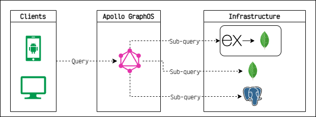
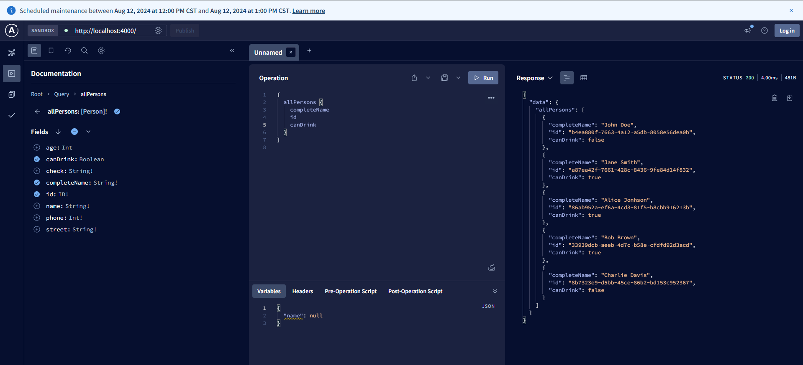

# GraphQL

<br />
<div align="center">
  <a href="https://github.com/cavidev/graphql">
      
  </a>
  
  <h3 align="center">GraphQL</h3>

  <p align="center">
    An awesome ROADMAP to learn and practice with GraphQL
    <br />
    <a href="https://graphql.org/learn/"><strong>Explore the docs »</strong></a>
    <br />
    <br />
    <a href="https://studio.apollographql.com/sandbox/explorer">View Demo</a>
    ·
    <a href="https://github.com/cavidev/graphql/issues/new?labels=bug&template=bug-report---.md">Report Bug</a>
    ·
    <a href="https://github.com/cavidev/graphql/issues/new?labels=enhancement&template=feature-request---.md">Request Feature</a>
  </p>
</div>
## Enviroment

## What is GraphQL

GraphQL is a query language for your API, and a server-side runtime for executing queries using a type system you define for your data. GraphQL isn’t tied to any specific database or storage engine and is instead backed by your existing code and data.

<div align="center">
    
</div>

## Types Definitions

You need to write the definitions, all in graphql need to will be defined

```js
// This can name "normal types"
const typeDefs = gql`
    ...
    type Person {
        age: Int
        canDrink: Boolean
        ...
    }
    ...
`;
```

### Special Types

Most types in your schema will just be normal object types, but there are two types that are special within a schema:

```js
// they define the entry point of every GraphQL query
schema {
  query: Query
  mutation: Mutation
}
```

<div>
    <table width="100%" >
        <tr>
            <th>Query</th>
            <th>Response</th>
        </tr>
        <td width="50%">
            <pre>
                <code class="language-javascript"> 
query {
    personCount
    findPerson(name: "John") {
        name
    }
}
                </code>
            </pre>
        </td>
        <td width="50%">            
            <pre>
                <code class="language-javascript">
{
    "data": {
        "personCount": 5,
        "findPerson": {
            "name": "John"
        }
    }
}            
                </code>
            </pre>
        </td>
    <table>
</div>

## Resolvers

Also, you need to write the resolvers, these are the methods that help us to manage the data, with them we can

- Return data
- Merge data
- Analize data
- Consult many resource and build a one result

```js
const resolvers = {
    Query: ...,
    Mutation: ...
    // Normal resolver... this will not work as entry point.
    Person: ...
};
```

### Query Resolver

```js
// persons can be a database call, or resource call
Query: {
    personCount: () => persons.length,
    allPersons: () => persons,
    findPerson: (root, args) => {
        const { name } = args;
        return persons.find((person) => person.name === name);
    },
}
```

### Mutation Resolver

```js
Mutation: {
    // This is the way how you can add a new data in the database
    addPerson: (root, args) => {
      const person = { ...args, id: uuid() };
      // This can be a database call.
      persons.push(person);
      // we need to return the person, if you want.
      return person;
    },
    editNumber: (_, args) => {
      const personIndex = persons.findIndex((p) => p.name === args.name);
      if (personIndex === -1) return null;
      const person = persons[personIndex];
      const updatedPerson = { ...person, phone: args.phone };
      persons[personIndex] = updatedPerson;
      updatePersons(persons);
      return updatedPerson;
    },
  }
```

## How can I create the server

```js
import { ApolloServer } from "apollo-server";
...
// Now we are creating a server, same as a Express
const server = new ApolloServer({
  typeDefs, // wrtie the Definations
  resolvers, // write the Resolver
});
```

## How a call looks like?

```sh
# As you can see, you only needs one endpoint with the POST verb.
# and sent the data as string.
curl --request POST \
    --header 'content-type: application/json' \
    --url http://localhost:4000/ \
    --data '{ "query":"mutation {\n  addPerson(\n    name: \"Carlos\"\n    phone: 555\n    street: \"Los Chiles\"\n    city: \"Los Chiles\"\n  ) {\n    name\n    phone\n    id\n  }\n}","variables":{}}'
```

## Manage error

You can cutome the error mesage if the user set en entry invalid with the class -<-UserInputError->- you can return a custome error

```js
  Mutation: {
    addPerson: (root, args) => {
      const person = { ...args };
      // Throw a custome message if the person is not unique
      if (persons.find((p) => p.name === person.name)) {
        throw new UserInputError("The person was previous added", {
          invalidArgs: args.name,
        });
      }
      // This can be a database call.
      persons.push({ ...person, id: uuid() });
      return person;
    },
  },
```

## Result

<div align="center">

</div>
